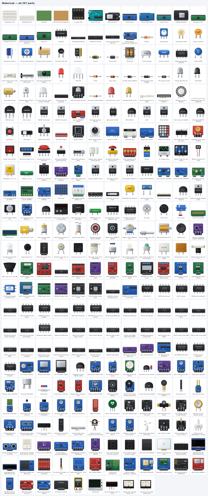

<h1 align="center">MakerLab</h1>

<p align="center">
  <b>A browser electronics &amp; Arduino simulator</b> — build circuits from 309 realistic parts, write a sketch, press Run.
</p>

<p align="center">
  <a href="https://github.com/jrp2026/Maker-Lab/actions/workflows/pages.yml"></a>
  <a href="https://jrp2026.github.io/Maker-Lab/"></a>
  <a href="https://nodejs.org"></a>
  <a href="https://react.dev"></a>
  <a href="https://www.typescriptlang.org"></a>
  <a href="https://vite.dev"></a>
  <a href="LICENSE"></a>
</p>

<p align="center">
  <a href="https://jrp2026.github.io/Maker-Lab/"><b>Open the live demo</b></a> ·
  <a href="#parts">Parts</a> ·
  <a href="#features">Features</a> ·
  <a href="#development">Development</a>
</p>

A Tinkercad-Circuits-style workspace: drag parts onto a breadboard, wire them pin to pin,
press **Start Simulation** and watch LEDs light, motors spin, meters read and Arduino
sketches run — all in the browser, no server. Works on desktop, tablets and phones, and
installs as an app that keeps working offline.

## Parts

All 309 parts, as they look on the breadboard:

<p align="center">
  
</p>

## Development

```bash
npm install
npm run dev        # http://localhost:5173
npm test           # solver, sketch compiler and end-to-end simulation tests
npm run build      # static site in dist/
```


## Features

- **First steps** – a welcome card on the first visit (*Try this first* loads and runs the Blink
  circuit), a 7-step guided tour of the parts list, wiring, code, Run button and examples, and
  quick starts on an empty canvas. The **?** button brings them back.
- **Canvas** – pan (drag background), zoom (wheel), breadboard and schematic views. The
  schematic names every part (R1, C1, U1…), draws ground and supply nets as symbols, and labels
  IC pins.
  Parts snap to the 0.1" grid; a leg sitting on a breadboard hole or Uno header plugs in
  (green outline). Hover a pin to see its connected strip and, while simulating, its voltage.
- **Phones & tablets** – the toolbar wraps to fit, **＋ Parts** opens the parts library as a
  bottom sheet, pinch to zoom and drag with two fingers to pan, tap a pin to start a wire (a
  **Cancel** button replaces Esc), the inspector docks at the bottom and the code editor
  opens full screen.
- **Install as an app** – on a phone use *Add to Home Screen* (Safari) or *Install app*
  (Chrome/Edge); MakerLab then opens full screen with its own icon and works offline.
- **Wiring** – click a pin, optionally click empty space to add bends, click another pin.
  Select a wire to recolour it, drag bend handles, double-click to add/remove bends, drag an
  end to reconnect.
- **Editing** – rotate `R`, flip `F`, delete `Del`, undo/redo `Ctrl+Z` / `Ctrl+Shift+Z`,
  copy/paste/duplicate `Ctrl+C/V/D`, shift-click or shift-drag to multi-select.
- **Parts (309)** – the whole component library from the brief, every entry placeable:
  - *surfaces*: half/full breadboard, perfboard, stripboard, DIP IC sockets
  - *passives*: resistors, pots, trimmers, rheostat, slide pot, LDR, NTC thermistor, ceramic/electrolytic/super
    capacitors, inductor, ferrite, transformer, crystal, resonator, X9C103 digital pot, varistor, 5 W power resistor,
    dual-gang pot
  - *diodes & opto*: LED, RGB, diode, zener, Schottky, TVS, IR LED, photodiode, phototransistor, bi-colour LED,
    RGB module, 10-segment bar graph, 10 mm and self-flashing LEDs, 12 V LED strip, germanium diode, laser, NeoPixel stick/ring/strip
  - *transistors*: NPN/PNP, N/P MOSFETs, 2N7000, MOSFET module, Darlington, optocoupler, JFET, IGBT, TRIAC, SCR
  - *switches & inputs*: button, slide/toggle/DIP/rotary switches, rocker switch, limit switch,
    TTP223 / TTP224 touch pads, 4×4 and 1×4 keypads, joystick, rotary encoder, arcade button,
    keyboard switch, 3-position slide switch, door sensor, emergency stop
  - *power*: batteries & holders, LiPo/18650 (state of charge), barrel jack, USB/USB-C, AC source,
    CR2032 coin cell, LiFePO4 cell, USB power bank, bench supply with current limit,
    78xx/79xx/LM317/AMS1117/HT7333 regulators, 3.3 V module, TL431 reference, B0505S isolated DC-DC,
    ICL7660 inverter, bridge rectifier, buck/boost/buck-boost converters, TP4056 charger,
    protection board, 3S BMS, solar panel & charge controller, fuses, polyfuse, terminal blocks, headers
  - *motors & audio*: DC, TT/N20/planetary/coreless gear motors, BLDC, servo, NEMA 17 and 28BYJ-48
    steppers, linear actuator, solenoid, electromagnet, vibration motor, 5 V fan,
    water pump, piezo, active buzzer, speaker, microphone, light bulb, traffic-light module, neon and
    panel indicator lamps, siren, Peltier module, heating pad, solenoid water valve
  - *drivers*: L298N, L293D, TB6612FNG, DRV8833, L9110S, MX1508, BTS7960, VNH2SP30, IRF520 and TIP120
    modules, A4988/DRV8825/TMC2208/TMC2209 step-dir drivers, ULN2003/ULN2803, ESC, BLDC controller, PCA9685
  - *logic gates*: NOT, buffer, AND, OR, NAND, NOR, XOR, XNOR, 3-input AND/OR as textbook symbols, plus a
    clickable logic input and a logic probe
  - *ICs*: 555, LM358, LM324, µA741, TL072, MCP6002, LM386, LM393, LM339, LM311,
    74HC00/02/04/08/10/11/14/20/27/32/74/86/125/157/245/283/393, CD4011, CD4066, CD4511, 74HC595, CD4017, 74HC4051, 74HC138,
    ADS1115 ADC, MCP4725 DAC, PCF8574 expander, ADuM1201 isolator
  - *memory & time*: 24LC256 EEPROM, W25Q32 flash, DS1307/DS3231 RTCs, SD / microSD modules
  - *sensors*: TMP36/LM35, DHT11/22, BMP280, LDR, IR obstacle, HC-SR04, PIR, Hall, MPU6050,
    ADXL335, QMC5883L, MQ-2, sound, vibration, tilt, reed, INA219, ACS712, voltage divider,
    rotary/quadrature/wheel encoders, resistive touch panel, SS49E linear Hall, KY-003, FSR, flex,
    soil moisture, rain, water level, YF-S201 flow, flame, TCRT5000 line tracker, MQ-135, MQ-3,
    pulse, GUVA UV, KY-013 NTC, piezo knock, TEMT6000, RCWL-0516 radar, Sharp IR distance,
    capacitive soil, load cell, SCT-013 current clamp, MQ-7, MQ-4, anemometer, laser receiver,
    photo interrupter, MPX5010 pressure
  - *displays*: 16×2/20×4 LCD (parallel & I2C), SSD1306 OLED 128×64/128×32, seven-segment (1 and 4 digits), 8×8 matrix,
    MAX7219 matrix module
  - *communication*: HC-05 Bluetooth, ESP-01 (AT Wi-Fi), NEO-6M GPS, nRF24L01, SIM800L GSM, RC522 RFID,
    PN532 NFC, MCP2515 CAN, MAX485 RS-485, USB-TTL / CH340 adapters, logic-level converter, SPI monitor
  - *boards*: Arduino Uno, Nano, Mega 2560, Micro; ESP32 DevKit; ESP8266 NodeMCU; Raspberry Pi Pico /
    Pico W; STM32 Blue Pill; Teensy 4.0; bare ATtiny85, ATmega328P, PIC16F877A and a generic MCU
    (powered from their own VCC pin); USBasp programmer
- **Simulation** – modified nodal analysis with Newton–Raphson for diodes/LEDs/BJTs and
  backward-Euler capacitors; motor back-EMF and inertia. Animated current dots on wires.
  Interactive parts: hold buttons, click switches and the multimeter dial, drag pot/LDR knobs.
- **Error flags** – short circuits, LED over-current and burn-out, reversed electrolytics,
  resistor over-power, overloaded Arduino pins / 5 V rail, missing ground, compile/runtime errors.
- **Board power** – dev boards (Uno, Nano, Mega, ESP32, Pico…) have a *USB cable* setting. A board
  placed from the library starts unplugged and stays off until VIN / VBUS gets 5–12 V through the on-board regulator, or the 5V / 3V3 rail is fed
  directly, with GND connected — or until you plug its USB cable in (inspector), which powers it
  from the computer (drawn as a cable). The examples come plugged in, except the robot cars,
  which run from their own batteries.
- **Probes** – the multimeter and the oscilloscope measure between both of their leads: with the
  COM probe or the scope's ground clip unconnected they show nothing and say which lead is missing.
- **Arduino code (every board)** – an Arduino C++ subset compiled to JavaScript generators:
  - per-board integer sizes, pin maps, ADC resolution, PWM/interrupt pins, CPU speed and
    `#if defined(ESP32)` / `__AVR__` style macros
  - `digitalWrite/Read`, `analogRead`, PWM `analogWrite`, ESP32 `ledc*`/`dacWrite`, `tone`, `pulseIn`,
    `shiftOut`, `millis`, `delay`, interrupts, `EEPROM`, `sprintf`/`dtostrf`/`strcpy`…
  - `Serial`, `Serial1–3` and `SoftwareSerial` really carry bytes between boards and modules;
    `Wire` (I2C) and `SPI` address the chips wired to them (raw register code works too)
  - **libraries**: Servo, LiquidCrystal(_I2C), Adafruit_NeoPixel, Adafruit_SSD1306/GFX, LedControl,
    Adafruit_PWMServoDriver, Stepper, AccelStepper, Keypad, NewPing, DHT, Adafruit_BMP280,
    Adafruit_MPU6050, QMC5883LCompass, Adafruit_INA219, Adafruit_ADS1X15, Adafruit_MCP4725, PCF8574,
    RTClib, SD, MFRC522, Adafruit_PN532, RF24, mcp_can, TinyGPS++
  - `struct`/`typedef`, pointers & references, `String`, multi-dimensional arrays, `enum`, `switch`
- **Block coding** – Tinkercad-style blocks (Blockly) with *Blocks*, *Blocks + Text* (live
  generated code) and *Text* modes. Pins are picked from the board's own pin list (PWM pins
  marked ~). Blocks for pins, PWM, RGB LEDs, tone, toggle, buttons, analog in percent, TMP36
  temperature, HC-SR04 distance, servo, I2C LCD, the serial monitor, waits, *every N ms*
  (non-blocking timers), *wait until*, loops, conditions, math (map, constrain, min/max, round,
  square root…), text, variables (whole or decimal numbers, chosen automatically) and your own
  **functions** with parameters and return values. Loose blocks that would never run are greyed
  out. Generated code targets the selected board.
- **✨ AI part generator** – describe a part that isn't in the library (“Morse telegraph key”,
  “Nixie tube”, “5 V reed relay”) and a model designs it: pins, Tinkercad-style art, schematic symbol,
  editable properties, and an electrical model built from the simulator's primitives plus
  formula-driven sources (`v(IN,GND)`, `i(REG)`, props, time). Parts can be refined in plain
  language, edited as JSON, saved to *My AI parts*, and they travel inside project files and
  share links. Providers:
  - **Claude** (Anthropic), **ChatGPT** (OpenAI), **Gemini** (Google) — paste your API key; it is
    stored only in this browser and sent only to that provider.
  - **Ollama** (`OLLAMA_ORIGINS=* ollama serve`) and **LM Studio** (Developer → start server,
    enable CORS) running locally — no key needed.
  Model output is treated as untrusted data: a strict validator whitelists shape types, colours,
  path data and formula functions, so specs (including ones from share links) can't run code.
  There's also a built-in example part to try without any AI.
- **Let an LLM build circuits** – hand [docs/llm-project-json.md](docs/llm-project-json.md) and the
  generated [docs/parts-reference.md](docs/parts-reference.md) (every part's exact pins and settings)
  to ChatGPT, Claude, Gemini… and ask for a project; import the JSON it writes with File → Import.
- **Projects** – autosave, save/open in the browser, JSON import/export, PNG export, and share
  links that carry the whole circuit in the URL.
- **Examples** (40, in five groups):
  - *getting started*: blink, button, dimmer, RC charging, motor, melody, servo, LCD, ESP32, interrupts,
    and an AI-made Morse telegraph key
  - *modules & ICs*: OLED, NeoPixel rainbow, weather station, parking sensor, stepper, RFID lock,
    555 blinker, 74HC595 chaser, two-board nRF24 remote
  - *advanced projects*: thermostat with hysteresis (relay + heater + LCD), traffic intersection
    (enum/switch state machine, interrupt crossing button), automatic plant waterer (OLED, MOSFET pump),
    stopwatch on a multiplexed 4-digit display, keypad door lock (Keypad, Servo, String), PWM fan
    controller (NTC beta equation), two-LDR solar tracker, reaction-time game (EEPROM high score),
    and two no-code logic circuits — a DIP-switch binary adder and a 555 → 74HC393 → CD4511 decimal counter
  - *robot cars*: an autonomous obstacle-avoiding ESP32 4WD car (servo-scanned HC-SR04) and a 3-sensor line
    follower, both with 2 × L298N, 4 TT motors, 2 × 18650 + TP4056 USB-C charger, power switch and boost
    converter, motor soft-start and battery monitoring
  - *logic gates* (no code): gates playground, half adder, full adder, SR latch (1 bit of memory from two
    NORs), 2-to-1 multiplexer, 3-input majority vote, XOR built only from NANDs, burglar-alarm logic

## Layout

```
src/sim/        solver.ts (MNA engine), netlist.ts, simulator.ts (stepping, warnings, wire flow)
src/mcu/        lexer/compiler (sketch → JS), runtime.ts (Arduino API, pin drive, scheduler, ISRs),
                boards.ts (board specs), libspecs.ts (library APIs for the compiler),
                stdlib.ts (serial, SPI, EEPROM, SD), devlibs/ (device libraries)
src/parts/      built-in parts authored as declarative specs; devices/ adds their TypeScript side
src/blocks/     Blockly block definitions + C++ generator, lazy-loaded editor
src/ai/         part spec + validator, formula language, provider clients, prompt
src/components/ part definitions: art, schematic symbol, pins, electrical model
src/ui/         canvas, library, inspector, code panel, toolbar
src/examples/   starter circuits
```

## Deployment

Pushing to `main` (or this project's working branch) runs `.github/workflows/pages.yml`: it
installs, tests, builds and publishes `dist/` to the `gh-pages` branch, which GitHub Pages serves.

## Known limits

- Breadboard view is top-down with shading rather than true isometric.
- Networking isn't simulated (ESP32/ESP8266/Pico W Wi-Fi, Bluetooth LE); serial modules like the
  ESP-01 and HC-05 answer realistically instead. User-defined `class`es and function pointers
  (other than interrupt handlers) aren't supported — the compiler says so.
- Complex chips are behavioural models (e.g. BLDC drive is averaged, radio links are ideal).
